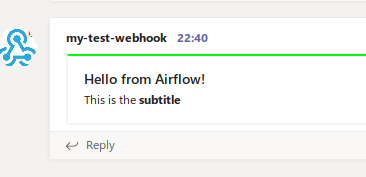

Airflow operator that can send messages to MS Teams

Example:

    op1 = MSTeamsWebhookOperator(task_id='msteamtest',
        http_conn_id='msteams_webhook_url',
        message = "Hello from Airflow!",
        subtitle = "This is the **subtitle**",
        theme_color = "00FF00",
        #proxy = "https://yourproxy.domain:3128/",
        dag=dag)

Results in:

        

## Usage

### Prepare MS Teams

In your MS Teams channel, click on the `...` > Connectors

Search for `Incoming Webhook` and configure it. Give it a name such as `my-test-webhook`

Once created you will be given a Webhook URL.  

### Create an HTTP Hook

You will need to prepare the HTTP Hook in Airflow's Admin > Connections:

    Conn Type = HTTP  
    Host = https://outlook.office.com/webhook/....full-url...

### Copy the files

Copy both the operator and hook `.py` files to your DAG folder and then import it

    from ms_teams_webhook_operator import MSTeamsWebhookOperator

### Operator call

You can now use the MSTeamsWebHookOperator.  The `message` and `subtitle` fields are templated.

    op1 = MSTeamsWebhookOperator(task_id='msteamtest',
        http_conn_id='msteams_webhook_url',
        message = "Hello from Airflow!",
        subtitle = "This is the **subtitle**",
        theme_color = "00FF00",
        #proxy = "https://yourproxy.domain:3128/",
        dag=dag)

The `theme_color` is a hex color without the #
